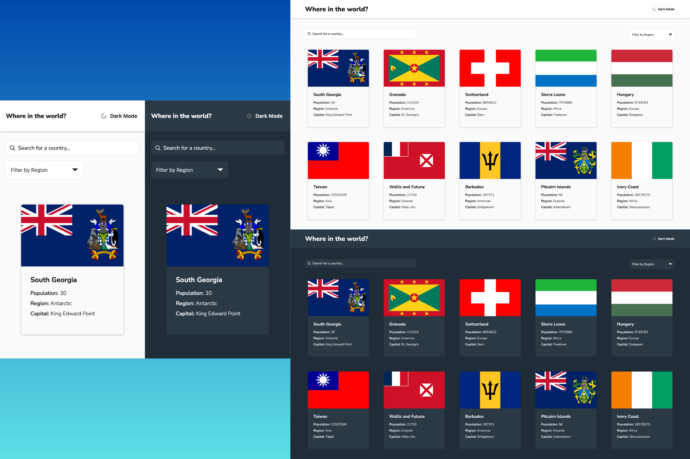

# Frontend Mentor - REST Countries API with color theme switcher solution

This is a solution to the [REST Countries API with color theme switcher challenge on Frontend Mentor](https://www.frontendmentor.io/challenges/rest-countries-api-with-color-theme-switcher-5cacc469fec04111f7b848ca). Frontend Mentor challenges help you improve your coding skills by building realistic projects. 

## Table of contents

- [Overview](#overview)
  - [The challenge](#the-challenge)
  - [Screenshot](#screenshot)
  - [Links](#links)
- [My process](#my-process)
  - [Built with](#built-with)
  - [What I learned](#what-i-learned)
  - [Continued development](#continued-development)
  - [Useful resources](#useful-resources)
- [Author](#author)

## Overview

### The challenge

Users should be able to:

- See all countries from the API on the homepage
- Search for a country using an `input` field
- Filter countries by region
- Click on a country to see more detailed information on a separate page
- Click through to the border countries on the detail page
- Toggle the color scheme between light and dark mode *(optional)*

### Screenshot

### Links

- Solution URL: [github.com/915fonzie/rest-countries-api](https://github.com/915fonzie/rest-countries-api)
- Live Site URL: [fonzies-countries-api.netlify.app/](https://fonzies-countries-api.netlify.app/)

## My process

### Built with

- Semantic HTML5 markup
- CSS custom properties
- SASS
- flexbox
- Mobile-first workflow
- [React](https://reactjs.org/) - JS library
- [React Router](https://reactrouter.com/en/main) - React framework
- [React Query](https://tanstack.com/query/latest) - state management library
- [Framer Motion](https://www.framer.com/motion/) - For animations

### What I learned

This was my first time using createBrowserRouter and loaders from React Router in conjuction with framer motion and react-query.
Every challenge I faced in this project had to do with making all three of these work together.
To be able to use framer motions AnimatePresence with react router, I had to create an outlet wrapper with AnimatePresence to be able to use animations between page transitions.
Then, when it came to fetching, I used an initial useQuery inside a loader for each page to get data from the API and then I also used another useQuery when the page is loaded to check if that data exists/isn't stale and will use the data stored in cache if that is the case.

### Continued development

I want to learn more about how loaders and actions work as well as dive deeper into react queries and see all the possibilities it provides.

### Useful resources

- [React Query meets React Router](https://tkdodo.eu/blog/react-query-meets-react-router) - This article was very helpful in learning how to put loaders and queries together.

## Author

- Website - [Alfonso Pruneda-Suarez](https://www.fonziepruneda.com)
- Frontend Mentor - [@915fonzie](https://www.frontendmentor.io/profile/915fonzie)

